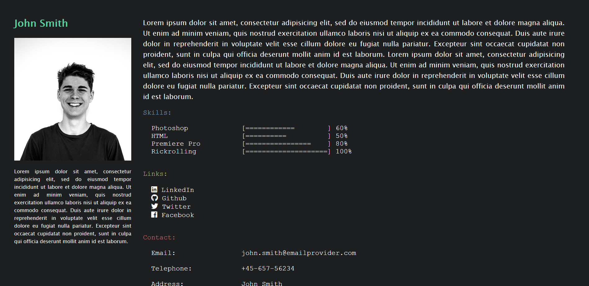

# bash-CV

bash-CV is an simple, open source, Personal Website HTML Template with a command line interface. Perfect for programmers, geeks, and whoever finds the Command Line cool. It is based on HTML, CSS and vanilla JavaScript and thus compatible with GitHub Pages.

## Usage

Simply fork or download the project and start customizing the index.html and main.js files to show the text you desire. You can then use Github Pages or any other hosting service to publish it.

## Live demo:

You can see the website in action [here.](https://erik-42.github.io/bash-cv/) Hint: Enter rickroll as a command ;-)

================================

Modifications du projet pour le passer sous React

export de la structure du projet
node export-file-structure.js

================================

lancement du projet
npm run dev

localhost:3000

================================
